# Activity Diagram — Sistem Absensi Karyawan
> Semua diagram menggunakan **Mermaid** syntax.  
> Render di: VS Code (Mermaid Preview extension), GitHub, atau https://mermaid.live

---

## Daftar Diagram

1. [Autentikasi — Login](#1-autentikasi--login)
2. [Autentikasi — Register & Approval Akun](#2-autentikasi--register--approval-akun)
3. [Absensi — Check In (GPS)](#3-absensi--check-in-gps)
4. [Absensi — Check Out & Deteksi Overtime](#4-absensi--check-out--deteksi-overtime)
5. [Absensi — Scan QR Code](#5-absensi--scan-qr-code)
6. [Izin — Pengajuan Izin](#6-izin--pengajuan-izin)
7. [Izin — Alur Approval Multi-Level](#7-izin--alur-approval-multi-level)
8. [Laporan — Generate & Export](#8-laporan--generate--export)
9. [Profil — Update Profil & Ganti Password](#9-profil--update-profil--ganti-password)
10. [Admin — Kelola Karyawan](#10-admin--kelola-karyawan)
11. [Token Refresh — Auto Renew JWT](#11-token-refresh--auto-renew-jwt)
12. [Alur Sistem Keseluruhan (Overview)](#12-alur-sistem-keseluruhan-overview)

---

## 1. Autentikasi — Login

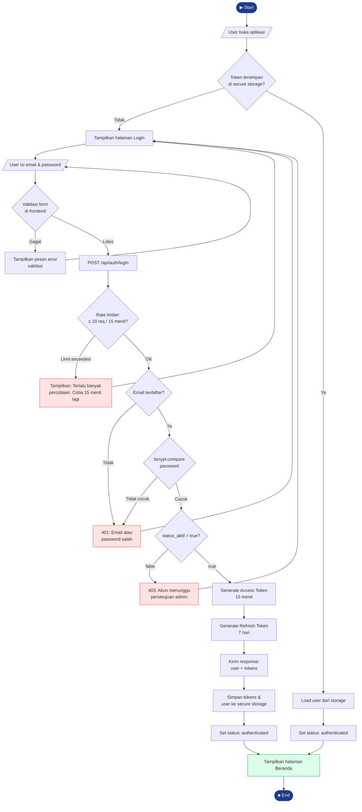

---

## 2. Autentikasi — Register & Approval Akun

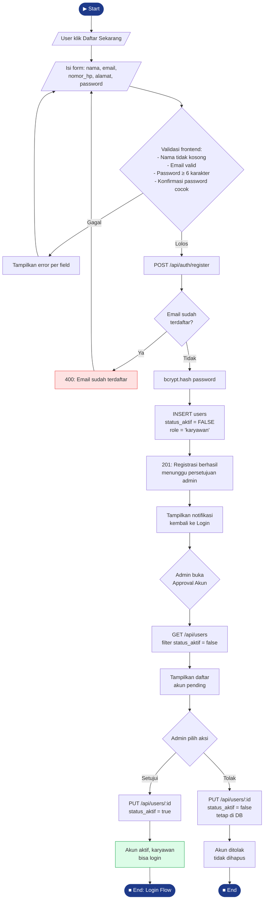

---

## 3. Absensi — Check In (GPS)

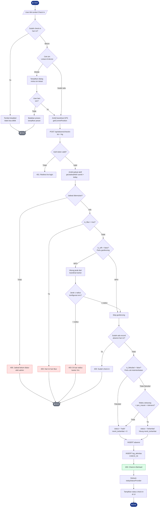

---

## 4. Absensi — Check Out & Deteksi Overtime

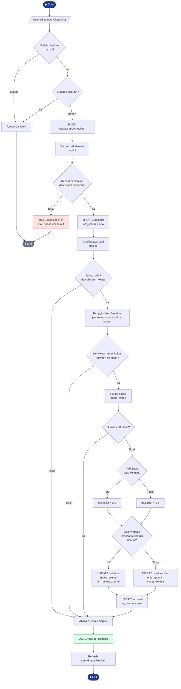

---

## 5. Absensi — Scan QR Code

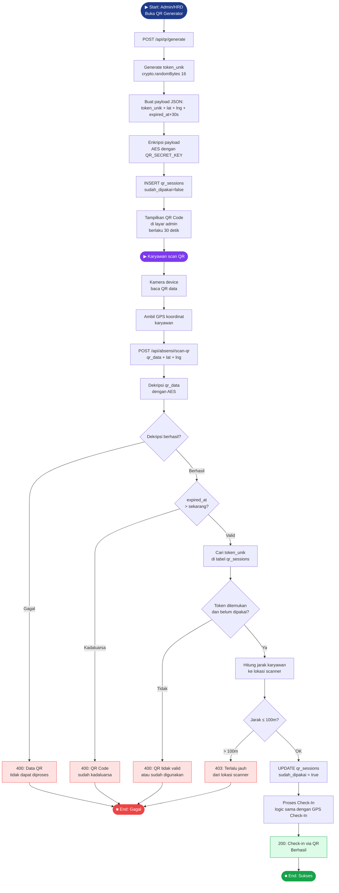

---

## 6. Izin — Pengajuan Izin

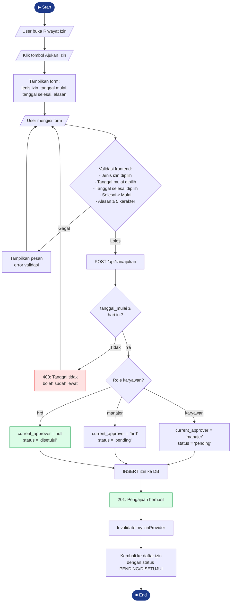

---

## 7. Izin — Alur Approval Multi-Level

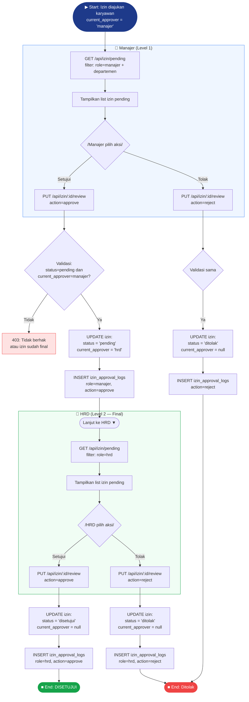

---

## 8. Laporan — Generate & Export

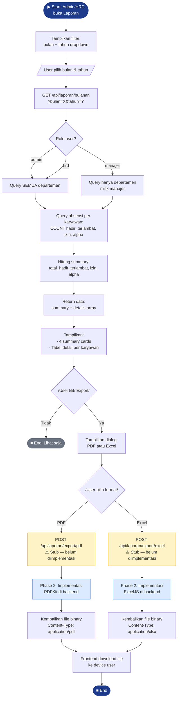

---

## 9. Profil — Update Profil & Ganti Password

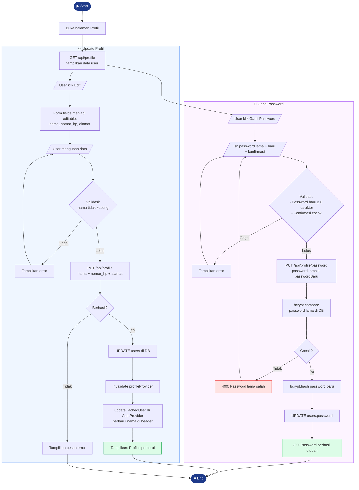

---

## 10. Admin — Kelola Karyawan

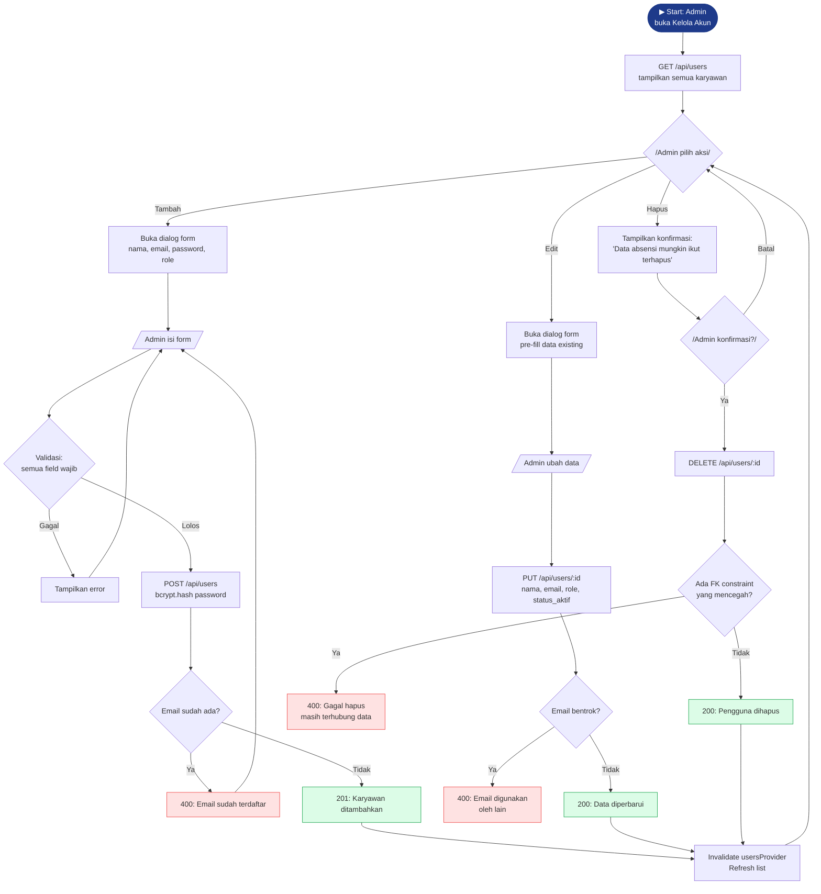

---

## 11. Token Refresh — Auto Renew JWT

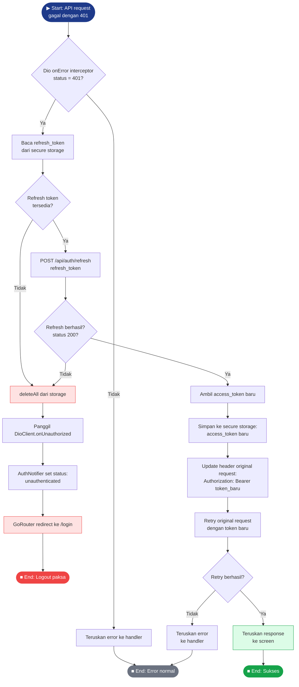

---

## 12. Alur Sistem Keseluruhan (Overview)

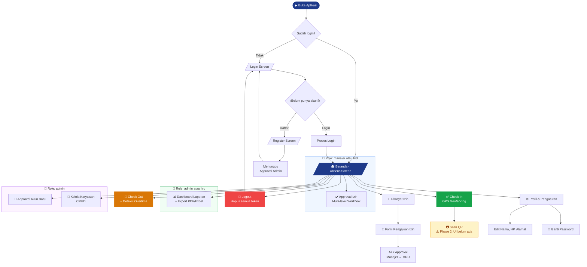

---

## Keterangan Simbol & Warna

| Simbol / Warna | Arti |
|---|---|
| `([▶ Start])` / `([■ End])` | Titik awal dan akhir alur |
| `{ }` | Decision / kondisi percabangan |
| `[ ]` | Aksi / proses |
| `[/ /]` | Input dari user |
| 🟦 Biru tua `#1E3A8A` | Start / End utama |
| 🟩 Hijau `#DCFCE7` | Sukses / berhasil |
| 🟥 Merah `#FEE2E2` | Error / gagal |
| 🟨 Kuning `#FEF3C7` | Fitur belum diimplementasi (stub) |
| 🟦 Biru muda | Swimlane role tertentu |

---

## Catatan Implementasi

### Alur yang sudah berjalan ✅
- Login & logout
- Register & approval akun
- Check-in GPS (dengan geofencing)
- Check-out & deteksi overtime
- Pengajuan izin
- Approval izin multi-level (manajer → HRD)
- Lihat laporan bulanan
- Update profil & ganti password
- Kelola karyawan (CRUD)

### Alur yang perlu diperbaiki ⚠️ (Phase 1)
- Token refresh tidak memicu logout → **Task 12**
- Status badge `'hadir'` tidak ditampilkan hijau → **Task 13**
- Form izin tidak validasi tanggal selesai ≥ mulai → **Task 16**
- Reject akun = hard delete → **Task 17**
- Profile update tidak refresh nama di header → **Task 18**

### Alur yang belum ada 🚧 (Phase 2)
- QR Scan: backend ada, frontend UI belum dibuat
- Export laporan: tombol ada, API call belum terhubung
- Notifikasi real-time: tabel `notifikasi` ada, endpoint & UI belum
- Default shift fallback: karyawan tanpa jadwal tidak bisa check-in
